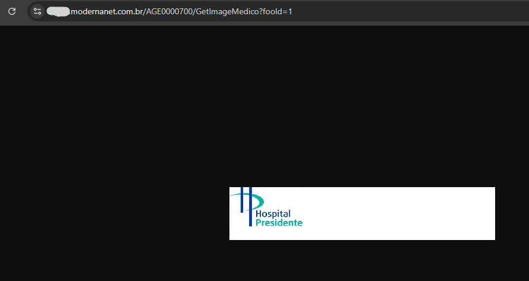

# CVE-2025-0970
The Modernanet System by Benner is vulnerable to IDOR - Insecure Direct Object Reference.

**Affected Version: < 1.1.1**

## POC

This vulnerability resides in the /AGE0000700/GetImageMedico?fooId=1 page in fooId parameter,

Its possible to manipulate the parameter to insert other id and have access to doctors infos.

## Request example:

---

## After intercepting the request, you can use the Intruder option in BurpSuite

### Intruder Example

Observe, we have a longer response length when the letter is 'q', i.e. the first letter of the database name is 'q'.

You can repeat this, to the other letters

## Full url
https://IP/Home/JS_CarregaCombo?formName=DADOS_PESSOAIS_PLANO&additionalCondition=&insideParameters=&elementToReturn=DADOS_PESSOAIS_PLANO&ordenarPelaDescricao=true&direcaoOrdenacao=asc&_=1739290047295

---

## Reference

https://modernasistemas.com.br/
