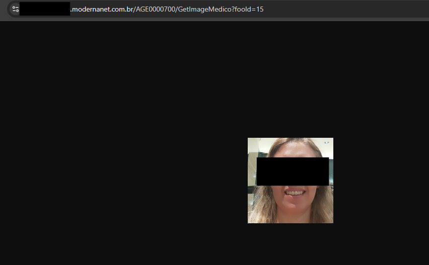
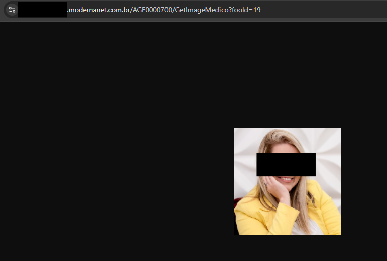

# CVE-2025-1642
The Modernanet System by Benner is vulnerable to IDOR - Insecure Direct Object Reference.

**Affected Version: < 1.1.1**

## POC

This vulnerability resides in the /AGE0000700/GetImageMedico?fooId=1 page in fooId parameter,

Its possible to manipulate the parameter to insert other id and have access to doctors infos.

## Request example:

---

## Request example manipulating the parameter:

## Full url
https://IP/AGE0000700/GetImageMedico?fooId=1

---

## Reference

https://modernasistemas.com.br/
