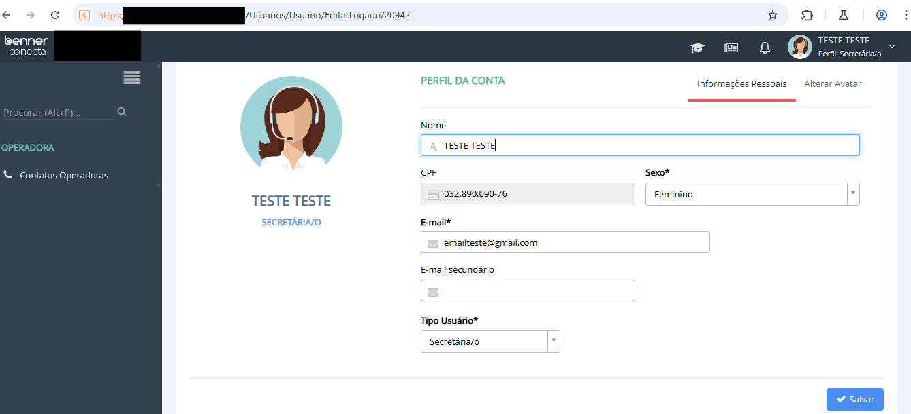
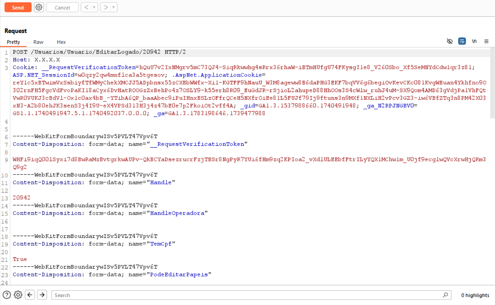
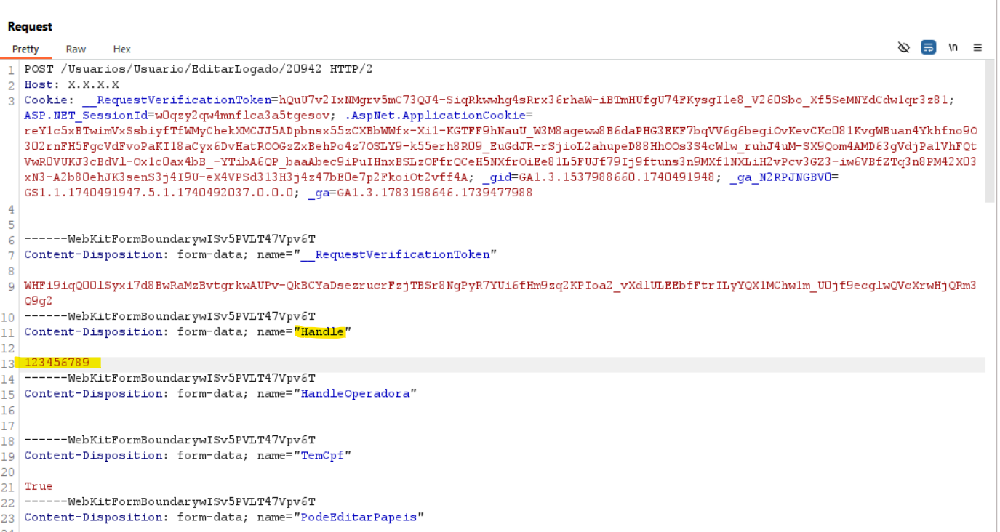
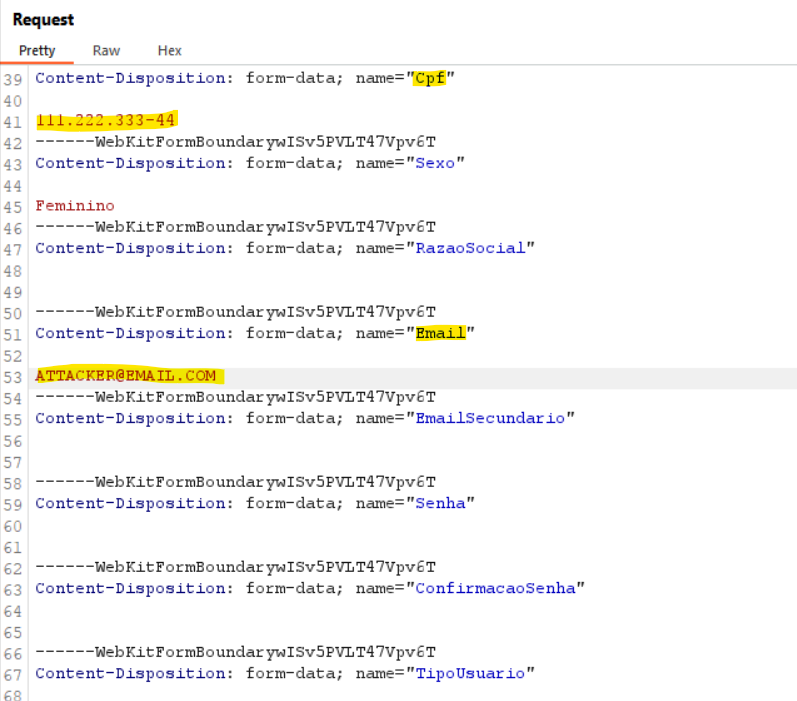

# CVE-2025-1645
The Modernanet System by Benner is vulnerable to IDOR - Insecure Direct Object Reference.

**Affected Version: 1.0.5330**

## POC

This vulnerability resides in the /Usuarios/Usuario/EditarLogado/YOUR-ID-HERE page,

Its possible to manipulate the parameter to insert other id and have access to change information for all accounts.

You can access "Minha Conta" → "Editar" and attempts to save changes, the request can be intercepted and modified to target another user's account by changing the Handle parameter.
Additionally, the system relies on a __RequestVerificationToken, which is session-bound but can be regenerated by re-accessing the account settings. This allows an attacker to perform multiple unauthorized modifications.

## First Step:

Navigate to "Minha Conta" → "Editar" and capture the request using an intercepting proxy (e.g., Burp Suite).

**Pay attention to the request, there are 2 IDs, the first in the URL and the second in the body**
**Only the ID in the body parameter must be changed**

## Second Step:
Modify the Handle parameter to the victim's user ID

## Third Step:
Change the Email field to an email controlled by the attacker, **you must change the CPF field to a valid CPF that is not registered yet**.

**Unfortunately, the "senha" (password) and "ConfirmacaoSenha" (ConfirmPassword) are disabled**

## Fourth Step:
Send the modified request while ensuring all headers, cookies, and __RequestVerificationToken remain valid.

## Fifth Step:
Navigate to https://IP/Account/EsqueciMinhaSenha and initiate the "Forgot Password" process using the newly modified email.

## Sixth Step:
Reset the victim's password and gain full control over their account.

## Full url
https://IP/Usuarios/Usuario/EditarLogado/YOUR-ID-HERE

---

## Reference

https://www.benner.com.br/saude-sistema/conecta/
