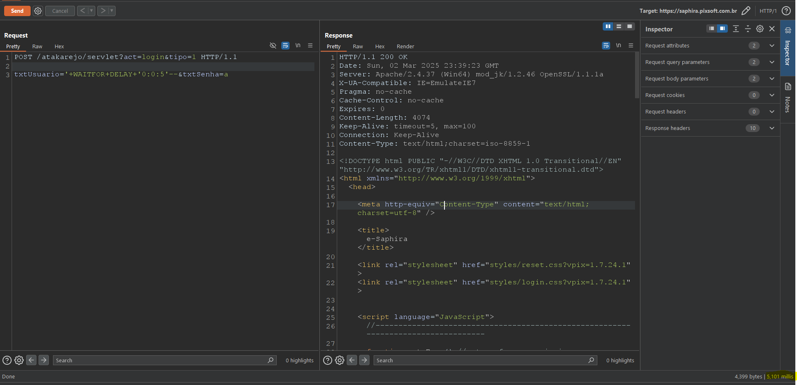

# CVE-2025-1808
The E-Saphira System by Pixsoft is vulnerable to Blind Time Based SQL Injection.

**Affected Version: < 1.7.24**
  

## POC

This vulnerability resides in the /servlet?act=login&tipo=1 page in txtUsuario parameter,

Its possible to manipulate the parameter to insert any SQL query in victim database.

Payload example: `'+WAITFOR+DELAY+'0:0:5'--`.

You can check the delay for the server to respond, this means that our injections is working.

## Request example:

---

## Full url
https://IP/{NAME-OF-CLIENT}/servlet?act=login&tipo=1#

---

## Reference

http://vivaz.pixsoft.com.br/