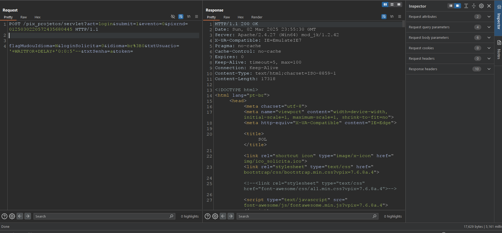

# CVE-2025-1809
The Sol System by Pixsoft is vulnerable to Blind Time Based SQL Injection.

**Affected Version: < 7.6.6**
  

## POC

This vulnerability resides in the /pix_projetos/servlet?act=login&submit=1&evento=0&pixrnd=0125021816444195731041 page in txtUsuario parameter,

Its possible to manipulate the parameter to insert any SQL query in victim database.

Payload example: `'+WAITFOR+DELAY+'0:0:5'--`.

You can check the delay for the server to respond, this means that our injections is working.

## Request example:

---

## Full url
https://IP/pix_projetos/servlet?act=login&submit=1&evento=0&pixrnd=0125021816444195731041

---

## Reference

https://www.pixsoft.com.br/sol-software-gestao-processos-workflow.htm