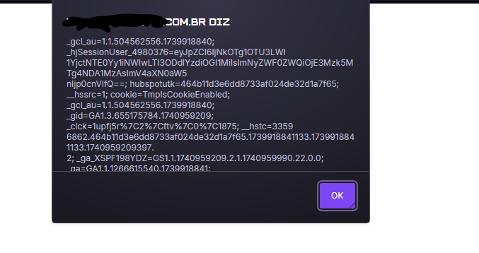

# CVE-2025-1810
The Vivaz System by Pixsoft is vulnerable to Reflected Cross-site-scripting.

**Affected Version: < 6.0.11**
  

## POC

This vulnerability resides in the /servlet?act=login&submit=1&evento=0&pixrnd=0125021817031859360231&sistema=0 page in sistema parameter,

Its possible to manipulate the parameter to insert any JavaScript code in victim browser.

Payload example: `">`.

You can check the alert box on the screen, this means that our injections is working.

## Request example:

---

## Full url
https://IP/servlet?act=login&submit=1&evento=0&pixrnd=0125021817031859360231&sistema=">

---

## Reference

https://www.pixsoft.com.br/vivaz-software-service-desk.htm