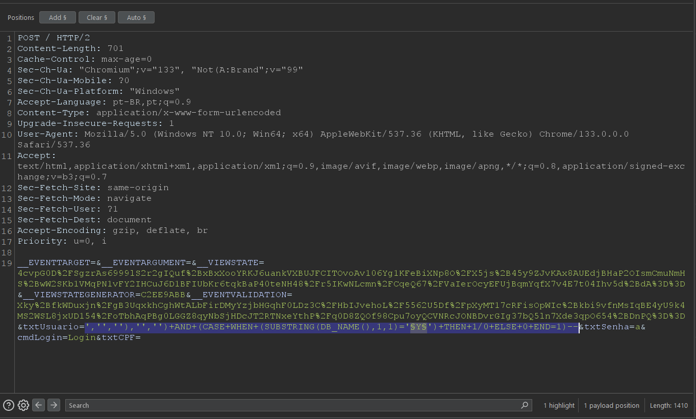

# CVE-2025-1811
The ATSVD System by AT Software Solutions is vulnerable to Blind Boolean Based SQL Injection.

**Affected Version: < 3.4.2**

**OBS: Tool like SQLmap doesn't work in this case**

## POC

This vulnerability resides in the /login.aspx page in txtUsuario parameter,

Its possible to manipulate the parameter to insert any SQL query in victim database.

Payload example: `','',''),'','') AND (CASE WHEN (SUBSTRING(DB_NAME(),X,1)='Y') THEN 1/0 ELSE 0 END=1)--`.

**The `','',''),'','')` part in the paylod is strictly necessary, this is to scape the REPLACE function, there are two REPLACE functions in the query, só its necessary scape it twice.**

If you want to retrieve the database name, **just for the POC**, its just needed to change the argument X to the database name index and Y to the database name character.

## Request example:

---

## After intercepting the request, you can use the Intruder option in BurpSuite

### Intruder Example

Observe, we have a different status code when the letter is 'l', i.e. the first letter of the database name is 'l'.

You can repeat this, to the other letters

## Full url
https://IP/

---

## Reference

https://atgroup.com.br